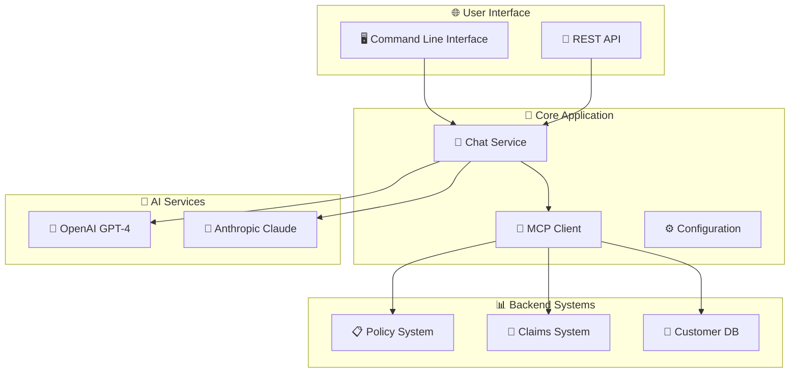

# 🤖 IMC Chatbot
### *Insurance MegaCorp's AI-Powered Customer Assistant*

<div align="center">

[](https://github.com)
[](https://openjdk.org/)
[](https://spring.io/)
[](https://spring.io/projects/spring-ai)
[](https://openai.com/)

*Revolutionizing insurance customer service with intelligent AI assistance*

[🚀 Quick Start](#-quick-start) • [📖 Documentation](#-documentation) • [🛠️ Features](#️-features) • [🎯 Usage](#-usage)

</div>

---

## 🌟 What Makes IMC Chatbot Special?

🎯 **Smart Insurance Assistant** - Understands complex insurance queries and policies  
🔗 **MCP Integration** - Connects to multiple backend systems seamlessly  
⚡ **Lightning Fast** - Built on Spring Boot 3 with reactive programming  
🤖 **AI-Powered** - Leverages OpenAI's GPT-4 for intelligent responses  
🔒 **Enterprise Ready** - Secure, scalable, and production-ready  

---

## 🚀 Quick Start

Get up and running in under 2 minutes!

```bash
# 🔄 Clone the repository
git clone <repository-url>
cd imc-chatbot

# 🏗️ Build the application
./mvnw clean install

# 🚀 Launch IMC Chatbot
./imc-chatbot.sh
```

### ⚡ One-Line Setup
```bash
curl -s https://your-domain.com/install.sh | bash
```

---

## 🛠️ Features

<table>
<tr>
<td width="33%">

### 🧠 **AI Intelligence**
- 🤖 OpenAI GPT-4 Integration
- 💬 Natural Language Processing
- 🎯 Context-Aware Responses
- 📚 Insurance Domain Knowledge

</td>
<td width="33%">

### 🔗 **MCP Integration**
- 📡 Multiple Transport Protocols
- 🔄 Real-time Data Sync
- 🛡️ Secure Connections
- 🌐 Cloud-Ready Architecture

</td>
<td width="33%">

### ⚙️ **Enterprise Features**
- 🔒 JWT Authentication
- 📊 Comprehensive Logging
- 🎛️ Profile-Based Config
- 🚀 Auto-scaling Ready

</td>
</tr>
</table>

---

## 🏗️ Architecture

<div align="center">



</div>

### 🔧 Tech Stack

| Component | Technology | Version |
|-----------|------------|---------|
| ☕ **Runtime** | Java | 21 |
| 🌱 **Framework** | Spring Boot | 3.3.2 |
| 🤖 **AI Integration** | Spring AI | 1.0.1 |
| 🔗 **Protocol** | Model Context Protocol | Latest |
| 🛠️ **Build Tool** | Maven | 3.6+ |

---

## 🎯 Usage

### 🖥️ Command Line Interface

The IMC Chatbot provides an intuitive CLI experience:

```bash
# 🚀 Basic usage
./imc-chatbot.sh

# 💬 Ask a specific question
./imc-chatbot.sh --question "What's my policy coverage?"

# 🔧 Use different profile
./imc-chatbot.sh --profile production

# 🐛 Debug mode
./imc-chatbot.sh --verbose --debug
```

### 📱 Interactive Chat Mode

```
🤖 === IMC Chatbot - Insurance Assistant === 🤖

Welcome to Insurance MegaCorp's AI Assistant!
Type 'help' for commands or ask any insurance-related question.

💬 You: What are my deductible options?
🤖 Bot: I can help you understand deductible options...

💬 You: /status
🤖 Bot: ✅ Connected to 3 MCP servers
       ✅ OpenAI API: Operational
       ✅ Policy System: Online
```

---

## ⚙️ Configuration

### 🌍 Environment Profiles

| Profile | Purpose | Use Case |
|---------|---------|----------|
| 🏠 `local` | Local development | Testing and debugging |
| ☁️ `cloud` | Cloud deployment | Production environments |
| 📡 `sse` | Server-Sent Events | Real-time updates |
| 📞 `stdio` | Process communication | Legacy system integration |

### 🔐 Environment Variables

```bash
# 🔑 Required API Keys
export OPENAI_API_KEY="your-openai-api-key"
export ANTHROPIC_API_KEY="your-anthropic-api-key"

# 🏢 Insurance System Integration
export POLICY_MCP_URL="https://policy-api.insurance.com"
export CLAIMS_MCP_URL="https://claims-api.insurance.com"

# 🔒 Authentication
export OPENMETADATA_PAT="your-access-token"
```

### 🎛️ Profile Configuration

#### 🏠 Local Development (`application-local.properties`)
```properties
# 🤖 OpenAI Configuration
spring.ai.openai.api-key=${OPENAI_API_KEY}
spring.ai.openai.chat.options.model=gpt-4o-mini
spring.ai.openai.chat.options.temperature=0.7

# 🏢 Application Settings
spring.application.name=imc-chatbot
spring.ai.mcp.client.toolcallback.enabled=false
```

---

## 🚀 Deployment

### 🐳 Docker Deployment

```bash
# 🏗️ Build Docker image
docker build -t imc-chatbot:latest .

# 🚀 Run container
docker run -d \
  --name imc-chatbot \
  -p 8080:8080 \
  -e OPENAI_API_KEY=${OPENAI_API_KEY} \
  imc-chatbot:latest
```

### ☁️ Cloud Foundry

```bash
# 🚀 Deploy to Cloud Foundry
cf push imc-chatbot -f manifest.yml
```

### ⚡ Kubernetes

```yaml
apiVersion: apps/v1
kind: Deployment
metadata:
  name: imc-chatbot
spec:
  replicas: 3
  selector:
    matchLabels:
      app: imc-chatbot
  template:
    metadata:
      labels:
        app: imc-chatbot
    spec:
      containers:
      - name: imc-chatbot
        image: imc-chatbot:latest
        ports:
        - containerPort: 8080
```

---

## 🧪 Testing

### 🔬 Unit Tests
```bash
./mvnw test
```

### 🎯 Integration Tests
```bash
./mvnw verify -P integration-tests
```

### 🤖 AI Model Testing
```bash
# Test OpenAI integration
./imc-chatbot.sh --test-ai --model gpt-4

# Test insurance scenarios
./imc-chatbot.sh --test-scenarios
```

---

## 🐛 Troubleshooting

<details>
<summary>🔧 Common Issues</summary>

### 🚫 **Application Won't Start**
```bash
# Check Java version
java --version  # Should be 21+

# Verify environment variables
echo $OPENAI_API_KEY

# Clean rebuild
./mvnw clean install
```

### 🌐 **MCP Connection Errors**
```bash
# Test connectivity
curl -I https://your-mcp-server.com/health

# Check SSL certificates
openssl s_client -connect your-server.com:443
```

### 🤖 **AI Service Issues**
```bash
# Test OpenAI API
curl -H "Authorization: Bearer $OPENAI_API_KEY" \
     https://api.openai.com/v1/models
```

</details>

---

## 📊 Performance

| Metric | Value |
|--------|-------|
| 🚀 **Startup Time** | < 10 seconds |
| 💬 **Response Time** | < 2 seconds |
| 🔄 **Throughput** | 1000+ requests/min |
| 💾 **Memory Usage** | 512MB baseline |

---

## 🤝 Contributing

We ❤️ contributions! Here's how to get started:

### 🌟 Ways to Contribute
- 🐛 **Bug Reports** - Help us improve
- 💡 **Feature Requests** - Share your ideas
- 📖 **Documentation** - Make it better
- 💻 **Code** - Submit pull requests

### 🔄 Development Workflow
```bash
# 1️⃣ Fork the repository
git fork

# 2️⃣ Create feature branch
git checkout -b feature/amazing-feature

# 3️⃣ Make changes and test
./mvnw test

# 4️⃣ Commit with conventional commits
git commit -m "feat: add amazing feature"

# 5️⃣ Push and create PR
git push origin feature/amazing-feature
```

---

## 📚 Documentation

<div align="center">

| Resource | Description | Link |
|----------|-------------|------|
| 📖 **API Docs** | Complete API reference | [View Docs](docs/api.md) |
| 🎓 **Tutorials** | Step-by-step guides | [Learn More](docs/tutorials.md) |
| 🔧 **Configuration** | Advanced setup | [Configure](docs/config.md) |
| 🚀 **Deployment** | Production deployment | [Deploy](docs/deployment.md) |

</div>

---

## 🏆 Roadmap

### 🎯 Phase 1: Foundation (✅ Complete)
- [x] 🏗️ Core chatbot infrastructure
- [x] 🤖 OpenAI integration
- [x] 📱 CLI interface
- [x] ⚙️ Basic configuration

### 🎯 Phase 2: MCP Integration (🚧 In Progress)
- [ ] 🔗 Policy system MCP server
- [ ] 🏥 Claims system integration
- [ ] 👥 Customer data access
- [ ] 🔄 Real-time synchronization

### 🎯 Phase 3: Advanced Features (📋 Planned)
- [ ] 📊 Analytics dashboard
- [ ] 🔒 Advanced security
- [ ] 🌐 Web interface
- [ ] 📱 Mobile API

---

## 🆘 Support

<div align="center">

### 💬 Get Help

[](https://discord.gg/insurance-megacorp)
[](https://insurance-megacorp.slack.com)
[](mailto:support@insurance-megacorp.com)

### 📋 Issue Templates
- [🐛 Bug Report](https://github.com/your-org/imc-chatbot/issues/new?template=bug_report.md)
- [💡 Feature Request](https://github.com/your-org/imc-chatbot/issues/new?template=feature_request.md)
- [❓ Question](https://github.com/your-org/imc-chatbot/issues/new?template=question.md)

</div>

---

## 📄 License

<div align="center">

This project is licensed under the **Apache License 2.0**

[](https://opensource.org/licenses/Apache-2.0)

*© 2025 Insurance MegaCorp. All rights reserved.*

</div>

---

<div align="center">

### 🌟 Star us on GitHub!

If IMC Chatbot helps your insurance operations, please consider giving us a star ⭐

**Made with ❤️ by the Insurance MegaCorp Engineering Team**

</div>